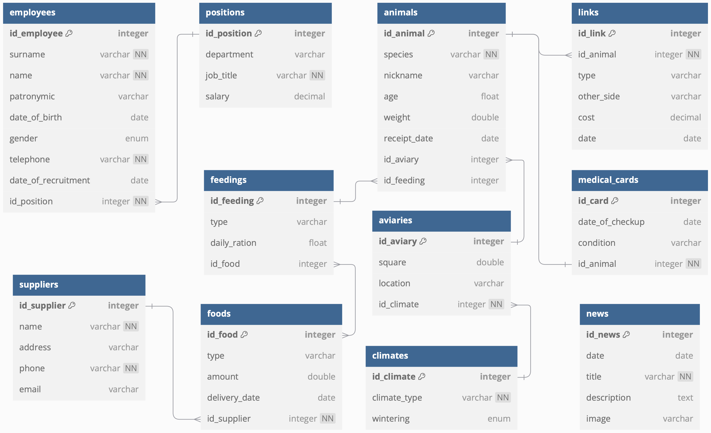

# Система управления работы зоопарка, Виктор Петровский, 253505

## Краткое описание проекта

Проект представляет собой информационную систему для автоматизации работы зоопарка, обеспечивающую хранение и обработку данных о животных, вольерах, кормах, медицинских картах, сотрудниках зоопарка, его спонсоров и поставщиков. Проект позволит повысить эффективность управления зоопарком, а также провести анализ его работы.

## Функциональные требования

1. Просмотр информации: Посетители имеют возможность просмотра информации о плане и новостях зоопарка, видах животных.
2. Обратная связь: Посетители имеют возможность отправки сообщений о возможных замечаниях или предложениях.
3. Управление пользователями: Администратор зоопарка осуществляет добавление, изменение и удаление учетных записей сотрудников.
4. Авторизация/аутентификация: Сотрудники имеют возможность осуществлять вход в информационную систему зоопарка по выданным реквизитам.
5. Управление данными о животных: Сотрудники отдела животных осуществляют добавление, удаление и редактирование информации о животных.
6. Управление данными о вольерах: Сотрудники отдела животных осуществляют распределение животных по вольерам.
7. Контроль за кормлением животных: Сотрудники отдела животных осуществляют управление типом питания и рационом животных.
8. Ведение медицинских карт животных: Сотрудники отдела ветеринарии осуществляют ведение медицинских карт животных.
9. Управление данными о сотрудниках: Сотрудники отдела кадров осуществляют управление информации о должностях сотрудников.
10. Работа с данными отдела внешних связей: Сотрудники отдела внешних связей осуществляют управление продажами, покупками, обменами, дарениями и спонсорствами животных.
11. Ведение информации о поставщиках корма: Сотрудники отдела внешних связей добавляют, изменяют и удаляют информацию о поставщиках.
12. Журналирований действий пользователей: Администратор имеет возможность просмотра списка действий, совершенных сотрудниками в системе.

## Инфологическая модель базы данных

